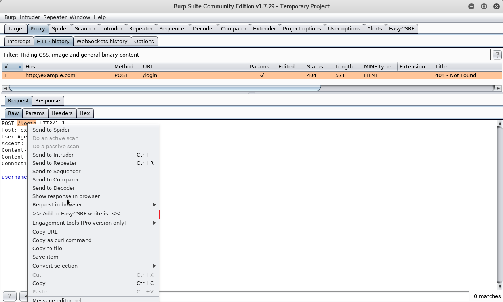

## EasyCSRF extension for Burp

EasyCSRF helps to find weak CSRF-protection in WebApp which can be easily bypassed. For example, content type based protection for API (Rest API, GraphQL API, etc) or CSRF-protection based on obscure data format (binary format, etc) are known to be weak. I presented some tricks to bypass CSRF-protection at [ZeroNights 2017](https://2017.zeronights.org/report/tricks-bypassing-csrf-protection/) conference.

_**EasyCSRF is not a scanner, deal with it.**_ Scanner implementation doesn't allow you to quickly check large WebApp with mixture of APIs and enpoints for CSRF vulnerabilities. Also scanner implementation has more false positives/negatives. EasyCSRF is a trade-off between manual and fully automatic check.

Extension automatically makes changes to POST/PUT/DELETE/PATCH requests and highlights modified requests in Proxy HTTP history. Researcher should trigger actions in WebApp, and judge by looking at WebApp's UI which modified requests are failed/succeeded. Actions that are succeeded after modification are potentially interesting, and you should investigate them deeper.

With EasyCSRF you can find APIs or endpoints that have weak CSRF-protection based on content type, referrer, obscure data format, etc.

EasyCSRF is written in python, it works with Burp Suite Free and Professional. To install it in Burp Suite follow [this instruction](https://support.portswigger.net/customer/portal/articles/1965930-how-to-install-an-extension-in-burp-suite). When installing EasyCSRF extension, **EasyCSRF** tab with three inner tabs (_**Settings**_, _**CSRF params/headers to remove**_, _**Requests whitelist**_) is added.

Inner tab _**Settings**_ allows to configure following options:
* Enable/disable EasyCSRF extension.
* Modify all or only in-scope requests.
* Remove HTTP headers that are used for CSRF-protection.
* Remove CSRF-token from parameters. URL-encoded, multipart, JSON parameters are supported.
* Change PUT/DELETE/PATCH method to POST.
* Convert URL-encoded body to JSON format.
* Set text/plain value for Content-Type header.
* Change POST/PUT/DELETE/PATCH request to GET request for url-encoded requests.

First four options are turned on by default.

Inner tab _**CSRF params/headers to remove**_ allows to configure parameter or header names which are used for CSRF-protection. EasyCSRF removes such parameters and headers.

Inner tab _**Requests whitelist**_ allows to specify whitelist of URLs. If URL for a request starts with URL in whitelist, EasyCSRF will not make modifications to such request. Note that you should specify port number when adding URL to the whitelist manually _**(this is also true for 80 or 443 ports)**_.

It is possible to add URLs to whitelist using context menu _**>> Add to EasyCSRF whitelist <<**_. For that you should select part of the path (starting with /) in Request Viewer or Repeater and invoke context menu. 

#### Probable usage scenario
1. You add some URLs to Burp's Target Scope.
2. You add URLs you want to skip (login URLs, etc) to EasyCSRF whitelist.
3. In Burp's Proxy History you can filter requests by selecting _**Show only highlited items**_ for convenience.
4. You browse WebApp through a browser, perform actions and look for succeeded actions.
5. You can find succeeded actions in Burp's Proxy History and further investigate or construct a PoC.